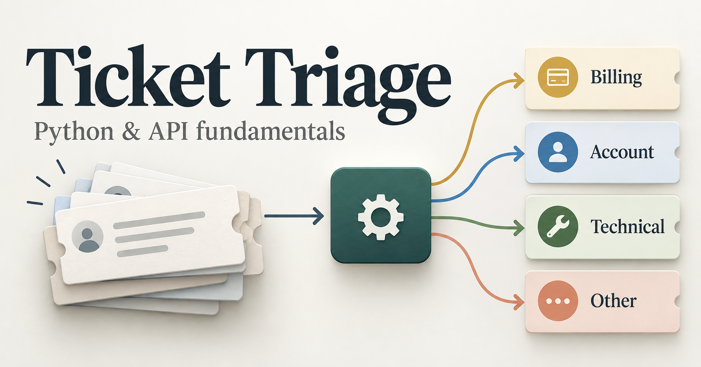

# Ticket Triage Lab

One ticket. Four categories. Rules first, then one model call.

## The customer problem

A simulated support inbox receives a small stream of tickets. Someone reads each one and chooses a destination. Routing is inconsistent, and nothing records how often that first choice was right.

Ticket Triage Lab is a portfolio prototype of the recommendation step:

**Read → Classify → Validate → Save → Measure**

The program recommends one category. It does not send a customer reply or change a live support system.

## What it does

- Reads one support ticket, an id and a text body, from a JSON file
- Assigns one allowed category: billing, account, technical, or other
- Starts with keyword rules so the baseline is inspectable
- Makes one structured model call and parses the result into a fixed schema
- Saves the prediction, the mode, and the timing as JSON
- Scores predictions against human labels on a development split and a holdout split

## Stack

| Layer | Choice | Why |
| --- | --- | --- |
| Language | Python 3.12 | Reads the ticket, runs the rules, and calls the API |
| Contracts | Pydantic | Checks required fields and allowed categories at the boundary |
| Model | OpenAI structured outputs | One live classification call with a schema, after the rule baseline |
| Config | python-dotenv | Keeps the API key in a local `.env` file |
| Tests | pytest | Locks contract failures, rule order, and API error behavior |
| Data | JSON files | Sample tickets and labeled cases, with no database |
